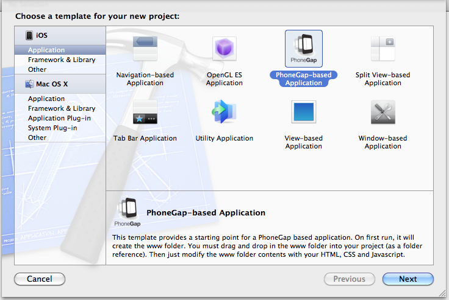
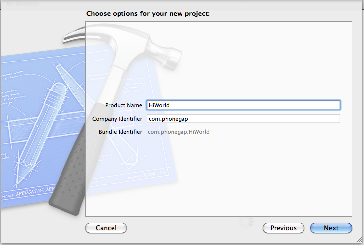
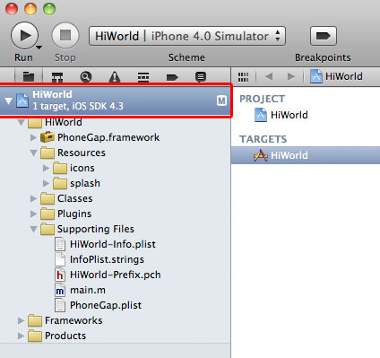
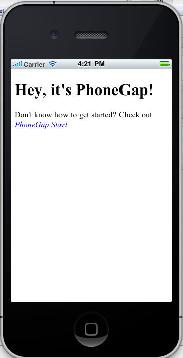

Getting Started with iOS
========================

Video Tutorials:
----------------

- [PhoneGap Installer - Xcode 4 Template](http://www.youtube.com/v/R9zktJUN7AI?autoplay=1)

1. Requirements
---------------
- Intel-based computer with Mac OS X Snow Leopard (10.6)
- Necessary for Installing on Device:
    - An Apple iOS device (iPhone, iPad, iPod Touch)
    - iOS developer certification

2. Install SDK + PhoneGap
-------------------------

- Download and install Xcode from [Apple Developer Portal](http://developer.apple.com) (Membership required)

- Donwload the latest copy of [PhoneGap](http://phonegap.com/download) and extract its contents. We will be working with the Android directory.

3. Setup New Project
--------------------

- Launch Xcode, then under the File menu select **New** and then **New Project...**
- Select **PhoneGap-based Application** from the list of templates

    
- Select the **Next** button, Fill in the "Product Name" &amp; "Company Identifier" for your app

    
    
- Choose a directory to store your app
- You should see your project in Xcode 4 now. Press the **Run** button in the top left corner. Your build should succeed and launch in the simulator
- You should see a error in your simulator informing you index.html was not found
- To fix this, we need to copy the **www** directory into the project. Right click on the project in the left navigation window and click show in finder
- In Finder, you should see the **www** directory beside your project
- Next step is **IMPORTANT**! Drag the **www** folder into Xcode 4. You can't just drag the www folder into your app's folder. It needs to be dragged into Xcode 4!! In my case I would drag it and drop it on HiWorld shown below.
    
    
- After you drag, you should see a prompt with a few options. Make sure to select **Create folder references for any added folders**. Click Finish

4. Hello World
--------------

Open the folder named **www** and type `<h1>Hello World</h1>` after the `<body>` tag in **index.html**. You can also add any associated Javascript and CSS files there as well.
    
    
5A. Deploy to Simulator
-----------------------

- Make sure to change the Active SDK in the top left menu to **Simulator+version#**.
- Hit **Run** in your project window header.

5B. Deploy to Device
--------------------

- Open [AppName]-Info.plist and change **BundleIdentifier** to the identifier provided by Apple. If you have a developer license, you can access and run the Assistant at [here](http://developer.apple.com/iphone/manage/overview/index.action) and register your App.
- Make sure to change the Active SDK in the top left menu to **Device+version#**.
- Hit **Run** in your project window header.

        

Done!
-----

You can also checkout more detailed version of this guide [here](http://wiki.phonegap.com/w/page/39991939/Getting-Started-with-PhoneGap-iOS-using-Xcode-4-%28Template-Version%29).

